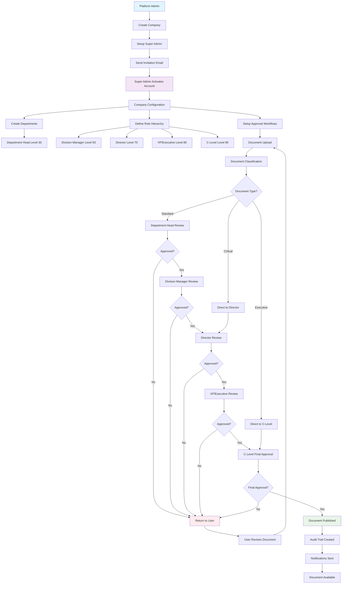
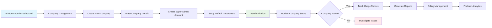
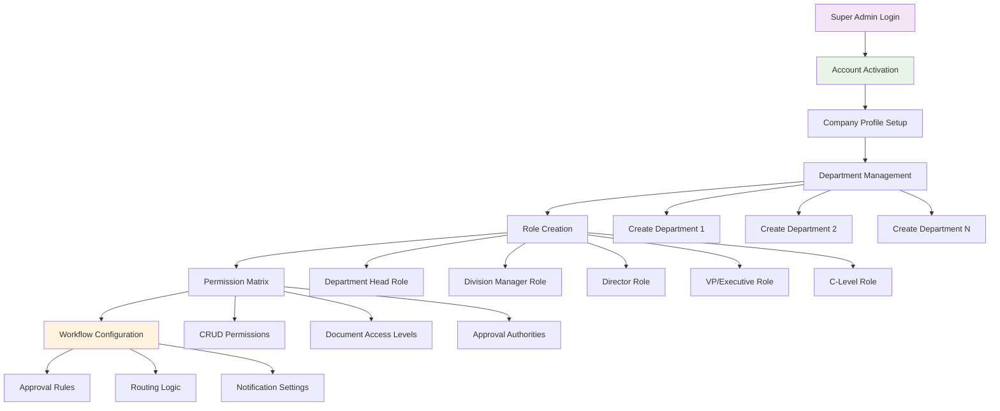
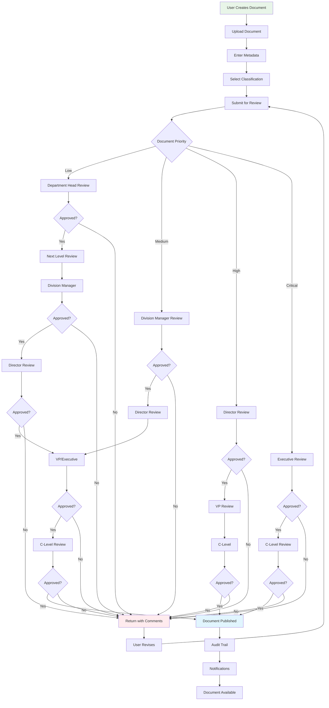
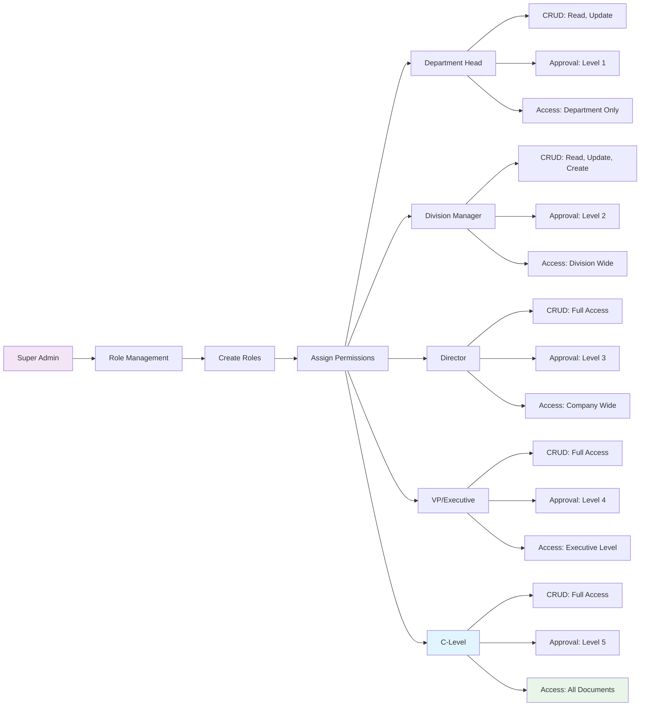
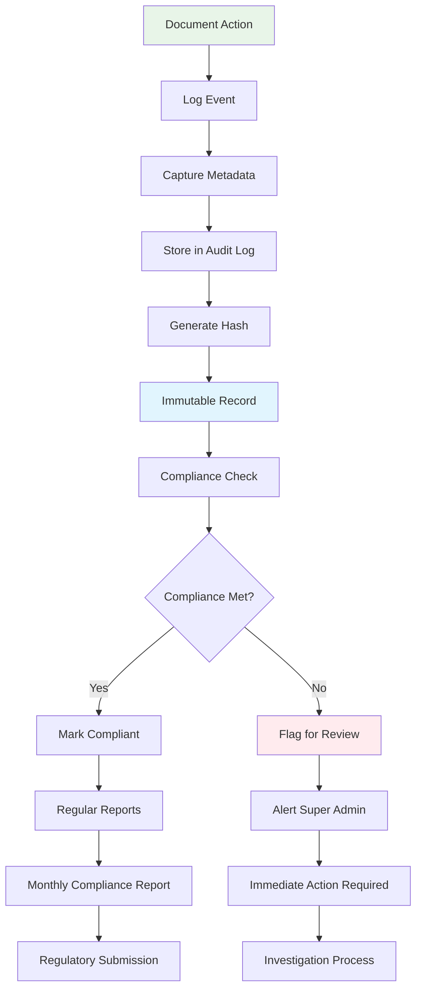
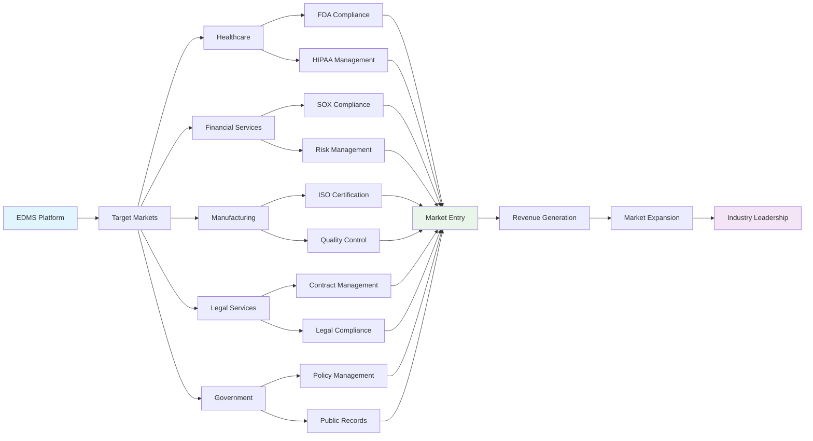
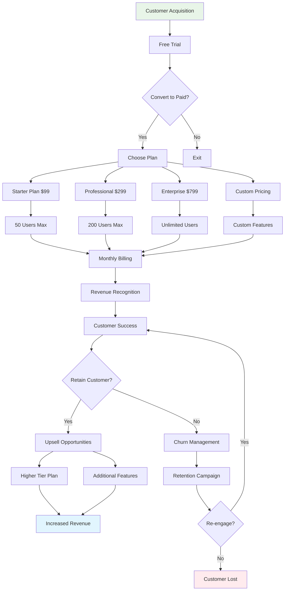
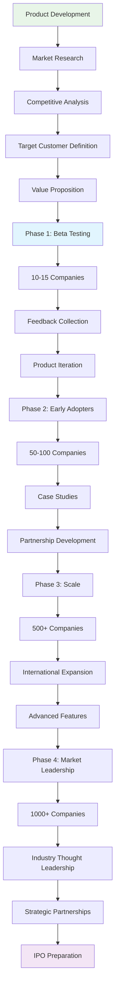
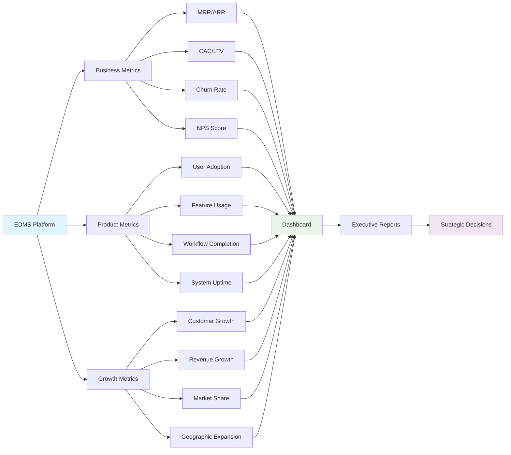

# EDMS Approval Workflow - Visual Flow Chart

## 🔄 **Complete System Flow**

## 🏢 **Platform Admin Workflow**

## 👑 **Super Admin Setup Workflow**

## 📄 **Document Approval Workflow**

## 🔐 **Permission Matrix Flow**

## 📊 **Audit Trail & Compliance Flow**

## 🎯 **Market Positioning Flow**

## 💰 **Revenue Model Flow**

## 🚀 **Go-to-Market Strategy Flow**

## 📈 **Success Metrics Dashboard**

---

## 🎯 **Key Decision Points**

### **Platform Admin Decisions:**

- ✅ Company approval/rejection
- ✅ Platform capacity management
- ✅ Billing and subscription handling
- ✅ System maintenance scheduling

### **Super Admin Decisions:**

- ✅ Role hierarchy definition
- ✅ Permission matrix setup
- ✅ Workflow configuration
- ✅ Department structure

### **Approval Level Decisions:**

- ✅ Document approval/rejection
- ✅ Routing decisions
- ✅ Escalation triggers
- ✅ Compliance verification

### **System Decisions:**

- ✅ Automatic routing based on rules
- ✅ Escalation procedures
- ✅ Notification triggers
- ✅ Audit trail creation

This comprehensive flow chart demonstrates the complete EDMS approval workflow, from platform administration to document approval, showing how the system handles complex enterprise requirements while maintaining security, compliance, and efficiency.
